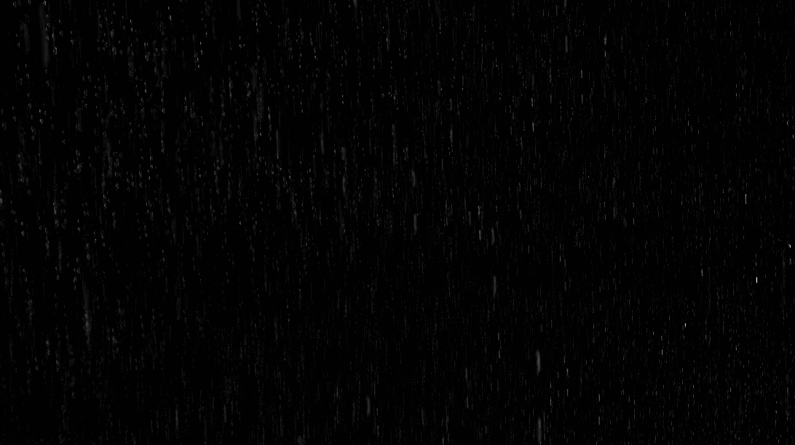
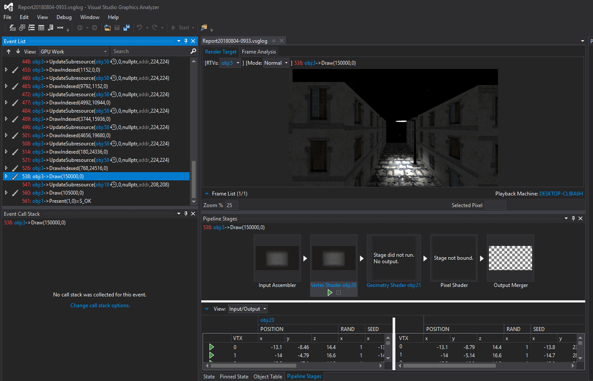
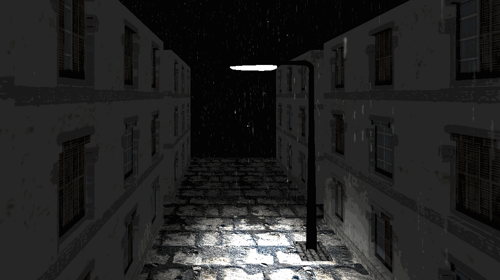

# Rain

Demo without background:

I have been wondering about rain simulation for a long time, but I could not find any online tutorial with detailed explanation and codes. Therefore, I study the Nvidia Rain SDK and want to share some of my thoughts with you guys.

For the general idea of the SDK, I suggest reading the RainSDKWhitePaper written by Sarah.

1.Vertex Shader Stream Out for animating rain particles.

This part is one of the most confusing part for me because I could not find any detailed explanation from Microsoft docs. As far as I know, vertex stream out has been used in the rain SDK and in skinning rendering. The main idea is passing the vertex shader bytecode into the CreateGeometryShaderWithStreamOutput. In other words, we are using a null geometry shader to make it fit into the API model. 

Look at the above image, the hardware actually skips the GS stage completely. The input data will be forwarded to the stream output and then the data will be streamed into memory. 

2.Texture Array and DDS format.

Texture Array is easy to use as we have 370 different textures and it is easy to bind each of them in a slot.

Alos, DDS format is an image format built for GPUs and they are used for 3D graphics.

3.The DXUT library has been deprecated.

As a result, use the Microsoft tex processing library which have CreateDDSFromFile and etc.

I rewrite several libraries that loads texturearray, look-up-tables and 3DTexture.

4.I write a .obj mesh loading function.

The tutorial is from https://www.braynzarsoft.net/viewtutorial/q16390-22-loading-static-3d-models-obj-format.

Microsoft provides a way: DirextXMesh. The only problem is that Meshconvert.exe can only convert around 65,000 vertices. With own loading function, one can load any .obj files and it is possible to use shaders to make an emissive point light by reading the sampled value of diffuse color from texture.

Demo with background:

I did not implement collision detection and rain splashes on the road. The reason is that my mesh object does not have a specular map and the outcome is wired if I use a Photoshop generated specular map. 

I will save the these two problmes to my next project: a rendering engine.

